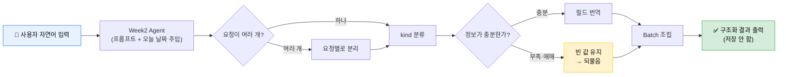

# Week 2 PRD — 자연어 요청 구조화 (1차본)

> **문서 성격:** 이 PRD는 "완성하고 덮는 문서"가 아니라 구현하면서 함께 갱신하는 살아있는 문서다.
> 아래는 요구사항 분석을 한 뒤 정리한 **1차 초안**이며, 구현·검증 과정에서 계속 다듬어 나간다.
>
> - 작성 시점 기준일(base_date 예시): **2026-07-08**
> - 대상 과제: `student_parts/week02_structure_natural_language_requests.py`

---

## 1. 문제 (Problem)

일정이 많은 사람은 (1) 일정을 까먹으면 리스크가 크고, (2) 기존 캘린더 앱은 날짜·시간·제목을 **폼에 직접 입력**해야 해서 등록 자체가 번거롭다. 그 마찰 때문에 일정 등록을 미루거나 빠뜨린다.

## 2. 사용자 · 시나리오 (User & Scenario)

- **누구:** 일정이 많고 누락 리스크가 큰 개인 사용자
- **어떻게 쓰나:**
  - ⓐ 자연어로 툭 던져서 등록 — "다음 주 화요일 3시 철수랑 회의"
  - ⓑ 말로 되물어 **상기(reminder)** 받기
- **가치 제안:** 입력의 부담을 **사용자 → 시스템**으로 옮긴다. 내가 앱 폼에 맞추는 게 아니라, 앱이 내 말을 알아듣는다.

### 왜 "자연어 구조화" 계층이 필요한가 (설계 근거)

자연어("내일 3시")는 뒷단(툴콜링 / API / 저장)이 **실행할 수 없는 형식**이다. 그래서 사람의 말을 `date` / `start_time` / `kind` / `members`처럼 **기계가 실행 가능한 구조**로 번역하는 계층이 필요하다 → 이것이 Week 2의 `StructuredRequest`다.
핵심: Week 2는 **"실행"이 아니라 "정확한 이해(구조화)"** 를 검증하는 단계다.

## 3. 핵심 요구사항 (Requirements)

- 자연어 요청 또는 Week 1 tool의 결과 JSON을 `StructuredRequest`로 구조화한다.
- 이번 스코프의 중심 `kind`는 **`personal_schedule`**, 보조로 `reminder` / `todo`.
- 상대 날짜("다음 주 화요일")는 `base_date`(오늘) 기준으로 실제 날짜로 계산한다.
- 결과는 항상 `StructuredRequestBatch`(리스트) 형태 — 요청이 하나여도 `requests` 리스트에 담는다.

## 4. 스코프 아웃 (이번엔 안 함)

- `group_schedule`(외부 멤버 일정 조율) — 하지 않음
- SQLite 저장, RAG — 하지 않음 (구조화 결과는 **저장하지 않는다**)
- 불확실하면 지어내지 않고 `unknown` / `None` / 빈 리스트로 두고 **되묻는다** (graceful fallback)

## 5. 인수 조건 (Acceptance Criteria)

`./run.sh --week2` 실행 후 `"다음 주 화요일 오후 3시에 철수랑 회의 잡아줘"` 입력 →
다음과 같은 `StructuredRequestBatch`가 `structured_response`로 출력되면 성공. **저장은 일어나지 않아도 된다.**

```json
{
  "requests": [
    {
      "kind": "personal_schedule",
      "title": "회의",
      "date": "2026-07-14",
      "start_time": "15:00",
      "end_time": null,
      "members": ["철수"],
      "priority": null,
      "reason": null,
      "original_text": "다음 주 화요일 오후 3시에 철수랑 회의 잡아줘"
    }
  ],
  "base_date": "2026-07-08"
}
```

| 확인 항목 | 통과 기준 |
|---|---|
| `kind` | `personal_schedule` |
| `date` | `2026-07-14` (상대 표현을 base_date 기준으로 계산) |
| `start_time` | `"15:00"` ("오후 3시" → 24h 번역) |
| `members` | `["철수"]` |
| `end_time` | `null` (안 알려준 값을 억지로 안 채움) |
| `original_text` | 원문 보존 |

## 6. 열린 질문 (Open Questions) — 진행 중, 주기적으로 갱신

> 버그가 아니라 "아직 정하지 않은 의사결정"들. 채워질 때마다 요구사항으로 승격된다.

| # | 열린 질문 | 기획 개념 | 등급 | 이번 Week2에서 |
|---|---|---|---|---|
| 1 | "다음 주 화요일"의 주 경계는? (월/일 시작) | 상대 날짜 해석 정책 | 中 | base_date로 일부 대응, 경계는 미정 |
| 2 | 삭제 등 파괴적 명령 전 사용자에게 확인받나? | destructive action guard | **高** | 스코프 밖 (다음 회차 후보) |
| 3 | 한 문장 복합 요청을 여러 요청으로 쪼개나? | multi-intent 분해 | 中 | ✅ `StructuredRequestBatch` 리스트 구조로 대응 |
| 4 | 같은 의도의 다른 표현 / 방언도 잡나? | NLU 견고성 / 평가셋 | 中 | 프롬프트 품질에 의존, 테스트 필요 |

---

## 유저 플로우



### 필드 번역 예시 (G 단계 상세)

| 사용자가 한 말 | 번역된 필드 |
|---|---|
| "다음 주 화요일" | `date = "2026-07-14"` |
| "오후 3시" | `start_time = "15:00"` |
| "철수랑" | `members = ["철수"]` |
| (안 알려준 종료시각) | `end_time = null` ← 억지로 안 채움 |

---

## 다음 단계

1. 이 PRD를 근거로 `week02_...py`의 TODO 6곳 구현
   (StructuredRequest / StructuredRequestBatch / week02_tools / week02_prompt_parts / week02_system_prompt / build_week02_agent)
2. 구현 중 발견 사항을 §6 열린 질문에 반영
3. §5 인수 조건으로 `./run.sh --week2` 검증
4. 최종적으로 "플로우 각 단계 ↔ 담당 함수" 매핑을 얹어 PR 회고에 첨부
```
