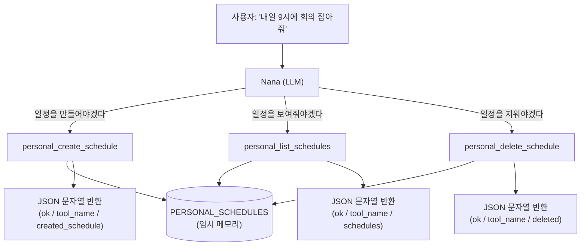
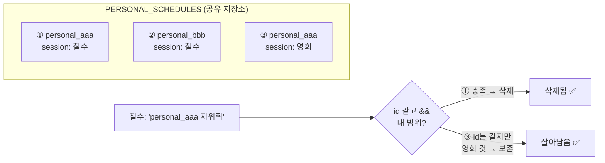

# Week 1 과제 — Nana 개인 일정 도구 구현

## 과제 목표
이번 주차 과제를 통해 무엇을 배우고자 했는지 간단히 적어요.

- LLM이 직접 호출할 수 있는 LangChain `@tool` 3개(생성·조회·삭제)를 만들어, **AI 에이전트가 도구를 스스로 골라 쓰는 구조**를 이해한다.
- 같은 저장소를 여러 대화가 공유할 때 `session_id`로 **대화 범위를 분리**해, 남의 데이터가 새지 않게 하는 방법을 익힌다.
- AI에게 "코드를 짜달라"가 아니라 **"개념을 설명받고 내가 직접 구현"**하는 방식으로, 결과뿐 아니라 *왜 그렇게 동작하는지*까지 책임질 수 있는 작업 습관을 만든다.

---

## 과제 위치
- 작업 브랜치 : `choidamul/week1`
- 주요 파일 : `student_parts/week01_wake_up_nana.py`

> 제공 코드(`fixed/` 등)는 수정하지 않고, `student_parts/`의 본인 주차 파일만 구현했어요.

---

## 구현한 기능
이번 주차 기본 미션 중 구현한 항목에 체크해요.

- [x] `personal_create_schedule` — 개인 일정을 현재 대화의 임시 메모리에 생성
- [x] `personal_list_schedules` — 현재 대화 범위의 일정을 날짜 범위로 조회
- [x] `personal_delete_schedule` — 현재 대화 범위에서 일치하는 일정만 삭제

세 도구 모두 `dict`를 만든 뒤 `_json(...)`으로 감싸 **JSON 문자열로 반환**하도록 구현했고, 앱 DB가 아닌 **현재 대화 전용 임시 메모리(`PERSONAL_SCHEDULES`)**만 사용했어요.

### 에이전트가 도구를 고르는 흐름

---

## AI 활용 내역
AI를 활용해 구현하거나 수정한 내용을 기록해요.
**이번 과제에서는 AI에게 코드를 생성받지 않았어요.** AI를 *학습·검증 도구*로 사용했고, 구현 코드는 직접 작성했어요.

### 도구 3개 구현 (생성 / 조회 / 삭제)
- AI 활용 내용 :
  AI에게 코드를 짜달라고 하는 대신, **(1) 과제 개념을 예시로 설명받고 → (2) 구현 순서(계획)를 내가 먼저 말로 세워 검토받고 → (3) 빈칸 틀(`___`)만 받아 직접 채우고 → (4) 피드백받는** 방식으로 진행했어요. 강사님이 권한 *plan 모드*의 사고방식(실행 전에 계획을 먼저 검증)을 사람이 직접 돌리는 형태로 적용했어요.
- 직접 수정한 부분 :
  세 함수의 본문을 전부 직접 작성했어요. 특히 (a) `attendees`가 `None`일 때 `[]`로 바꾸는 방어 코드, (b) 조회를 `PERSONAL_SCHEDULES` 원본이 아니라 `_current_session_schedules()`(내 대화 범위)에서 시작하도록 한 것, (c) 삭제 조건을 `id != schedule_id or scope != session_id`(남길 조건)로 뒤집어 작성한 부분을 스스로 판단해 넣었어요.
- 수정 이유 :
  코드를 받기만 하면 "왜 이렇게 동작하는지"를 설명할 수 없어요. 직접 구현해야 회고와 면접에서 *근거를 가지고* 설명할 수 있다고 판단했어요.

### 검증 시나리오 직접 설계
- AI 활용 내용 :
  "짰다 ≠ 작동한다"를 확인하려고, 정상 케이스만이 아니라 **위험 시나리오를 일부러 만들어** 검증하는 테스트를 설계했어요.
- 직접 수정한 부분 :
  철수·영희 두 대화를 흉내 내고, **영희 일정에 철수와 똑같은 `id`를 강제로 박은 뒤** 철수가 삭제를 호출해도 영희 일정이 살아남는지 확인하는 케이스를 추가했어요.
- 수정 이유 :
  ID가 같아도 대화 범위가 다르면 지우면 안 된다는 요구사항(가이드)이 실제로 지켜지는지는, 충돌 상황을 만들어야만 검증되기 때문이에요.

---

## 구현하면서 고민한 점
막혔던 부분, 고민한 내용, 해결 방법을 자유롭게 적어요.

- **고민 1 — `id`와 `session_id`를 헷갈림**
  - 고민한 점 : 둘 다 "id"가 들어가서 같은 것으로 착각했어요. 처음엔 "session_id를 만든다"고 계획했어요.
  - 해결 방법 : 역할을 분리해 이해했어요. `session_id`는 **이미 정해진 대화 주인을 `current_session_scope()`로 읽어오는 값**이고, `id`는 **일정마다 `_new_personal_id()`로 새로 발급하는 번호표**예요. "손님이 누구냐(읽기)" vs "이 일정의 번호표(발급)"로 구분했어요.

- **고민 2 — 삭제 조건이 왜 `and`가 아니라 `or`인가**
  - 고민한 점 : "ID 같고(`and`) 내 범위인 것"을 지우는 줄 알았는데, 코드는 "남길 것만 고르는" 방식이라 조건을 뒤집어야 했어요.
  - 해결 방법 : *지울 조건*(`ID 같다 AND 내 범위다`)의 반대가 *남길 조건*(`ID 다르다 OR 내 범위 아니다`)임을 예시로 확인했어요. 이 `or` 덕분에, 다른 사람의 같은 ID 일정이 보존돼요.

### `session_id`로 대화 범위를 분리하는 이유

> 핵심: ③은 철수의 요청 ID와 **같은 `personal_aaa`**지만, `session`이 영희라서 삭제되지 않아요. 삭제 함수의 `or` 한 줄이 이 보존을 책임져요.

### 검증 결과
직접 설계한 시나리오로 모든 케이스를 통과했어요.

| 검증 항목 | 결과 |
|---|---|
| `attendees=None` → `[]` 방어 | ✅ |
| `id`에 `personal_` 접두어 부여 | ✅ |
| 철수 조회에 영희 일정 안 섞임 (프라이버시) | ✅ |
| 날짜 범위 필터 (`2026-07-03`~`07-08` → 운동만) | ✅ |
| 철수 삭제 → `deleted: 1` | ✅ |
| **영희의 같은 ID 일정은 보존됨** (삭제 권한 범위) | ✅ |

> 알고 넘어간 한계 : Week 1은 임시 메모리라 입력 검증을 하지 않아요. 예) `date`에 `"내일"`을 넣어도 그대로 저장되고, `date_from > date_to`처럼 거꾸로 주면 빈 결과가 조용히 반환돼요. **에러는 아니지만 "검증이 비어 있는 지점"임을 인지**하고 넘어갔어요.

---

## 과제 회고 (KPT)

- **Keep** (좋았고 계속 유지할 점)
  - 코드를 받지 않고 **계획 → 직접 구현 → 검증**으로 진행해, 모든 줄을 설명할 수 있게 된 점.
  - "작동하나?"를 정상 케이스가 아니라 **충돌·프라이버시 같은 위험 시나리오로** 확인한 점.

- **Problem** (아쉬웠거나 막혔던 점)
  - `id`/`session_id` 혼동, 삭제 조건 `and`/`or` 같은 부분에서 멈췄어요. 자료구조(리스트/딕셔너리)와 조건 뒤집기(드모르간) 같은 기본기가 더 단단했다면 빨랐을 거예요.
  - `_current_session_schedules()` 위에 설명을 떠다니는 문자열로 적어, 파이썬이 무시하는 위치에 둔 점(동작엔 무관하지만 위치가 부적절).

- **Try** (다음에 시도해볼 점)
  - 입력 검증(잘못된 날짜 형식, 뒤집힌 범위)을 어디까지 도구가 막고 어디부터 프롬프트로 막을지 기준을 세워보기.
  - 시스템 프롬프트를 바꿔가며 **Nana가 올바른 도구를 고르는 비율**을 비교하는 간단한 평가를 직접 돌려보기.
